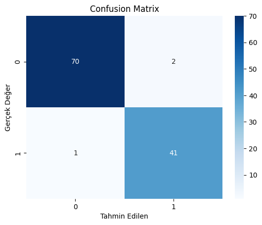

# Meme Kanseri Teşhisi – Lojistik Regresyon Modeli

## Projenin Amacı

Bu projenin amacı, meme kanseri teşhisinde **ikili sınıflandırma (Binary Classification)** yaparak tümörün:

* **Malign (Kötü Huylu)**
* **Benign (İyi Huylu)**

olup olmadığını tahmin etmektir.

Makine öğrenmesi yöntemi olarak **Lojistik Regresyon** kullanılmıştır.

---

## Veri Seti

Bu projede kullanılan veri seti:

[Veri Seti](../../data/breast_cancer.csv)

### Veri Seti Özellikleri

* Toplam örnek sayısı: **569**
* Özellik sayısı: **30 sayısal özellik**
* Hedef değişken:

  * `1` → Malign
  * `0` → Benign

---

## Kullanılan Yöntemler

Bu projede aşağıdaki yöntemler uygulanmıştır:

1. StandardScaler: Veri ölçeklendirme için kullanılmıştır

2. Lojistik Regresyon: İkili sınıflandırma için kullanılmıştır.

---

## Model Performans Sonuçları

### Performans Metrikleri

| Metrik    | Değer     |
| --------- | -----     |
| Accuracy  | 0.97      |
| Precision | 0.97      |
| Recall    | 0.95      |
| F1-Score  | 0.96      |

---

##  Confusion Matrix



---

## Kurulum ve Çalıştırma

Projeleri yerel makinenizde çalıştırmak için aşağıdaki adımları takip edebilirsiniz:

1. **Depoyu Klonlayın:**
```bash
git clone https://github.com/kullanici_adin/Deep-Learning.git
cd Deep-Learning

```


2. **Sanal Ortamı Hazırlayın:**
```bash
conda create -n breast_cancer python=3.10
conda activate breast_cancer

```


3. **Gerekli Kütüphaneleri Yükleyin:**
```bash
pip install -r requirements.txt

```


4. **Jupyter Notebook'u Başlatın:**
```bash
jupyter notebook

```