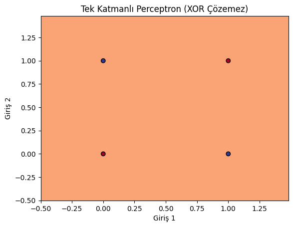
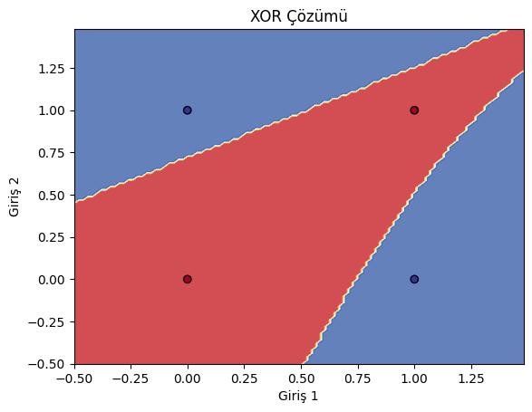

# Yapay Sinir Ağları ve XOR Problemi Analizi

Bu çalışma, yapay sinir ağlarının (YSA) tarihsel gelişimindeki en önemli dönüm noktalarından biri olan **XOR (Özel VEYA)** probleminin çözümünü ve çok katmanlı mimarilerin önemini deneysel olarak incelemektedir.

### XOR Mantık Tablosu

| Giriş 1 | Giriş 2 | Çıkış (XOR) |
| --- | --- | --- |
| 0 | 0 | 0 |
| 0 | 1 | 1 |
| 1 | 0 | 1 |
| 1 | 1 | 0 |

---

## Deney Aşamaları

### 1. Tek Katmanlı Model (Perceptron)

* **Sonuç:** Başarısız.
* **Analiz:** Gizli katmanı olmayan bir yapı, veriyi ayırmak için sadece düz bir çizgi çekebilir. XOR uzayında 1 ve 0 noktaları çapraz konumlandığı için model doğru bir şekilde ayırmayı başaramaz.

### 2. Çok Katmanlı Model (MLP - Multi-Layer Perceptron)

* **Mimari:** 1 Giriş Katmanı, 1 Gizli Katman (4 Nöron), 1 Çıkış Katmanı.
* **Aktivasyon Fonksiyonu:** `tanh` (Hiperbolik Tanjant).
* **Sonuç:** Başarılı.
* **Analiz:** Gizli katman, girdi uzayını doğrusal olmayan bir şekilde dönüştürerek sınıfların ayrılabilir hale gelmesini sağlamıştır.

---

## Karşılaştırmalı Karar Sınırları

<!-- 

  
  

 -->

| Tek Katmanlı Perceptron | Çok Katmanlı Sinir Ağı |
| --- | --- |
|  |  |

---

## Kullanım

Bu deneyi yerelinizde çalıştırmak için:

1. İlgili sanal ortamı aktif edin.
2. `xor_analysis.ipynb` notebook dosyasını açın.
3. Hücreleri sırasıyla çalıştırarak modellerin öğrenme süreçlerini gözlemleyin.

---